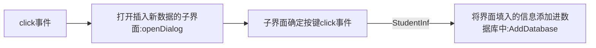

# 学生通讯录管理系统 基于PYQT5和Sqlite3 

[TOC]

## 实现基本功能

- 采用数据库管理用户名和密码

- 添加学生地址 手机号 性别等信息

- 管理信息包括**增加** **删除** **修改** 按不同信息**查找**

- 导出信息到PDF文件

- 采用PYQT框架，数据库链接前端TableWidget控件

## 登陆界面


​       输入用户名和密码，可以进行注册或登录操作，注册则保存到user.db数据库中，登录则查询数据库中是否有匹配的username和password


```python
class login_window(QtWidgets.QMainWindow, Ui_Form):
    """登录界面类
    使用同一组lineEdit登录或注册 初始化存储用户数据的数据库‘user.db’
    Methods:
        register_button:注册后用户名和密码将存储到user.db的user表格中
        login_button:登录时用当前lineEdit匹配数据库中的信息 验证密码
    """
    def __init__(self):
        super(login_window, self).__init__()
        self.setupUi(self)  # 创建窗体对象
        self.init()

    def init(self):
        self.pushButton.clicked.connect(self.login_button)  # 连接槽
        self.pushButtonreg.clicked.connect(self.register_button)

        # 连接数据库
        self.conn = sqlite3.connect('user.db')
        self.conn.row_factory = sqlite3.Row  # 设置返回结果为字典形式
        # 创建一个游标对象
        self.cursor = self.conn.cursor()
        # 创建表
        sql_text = '''CREATE TABLE IF NOT EXISTS user
                          (Username TEXT,
                           Password TEXT
                           );'''
        # 执行sql语句
        self.cursor.execute(sql_text)

    def register_button(self):
        # 直接用登陆界面输入的注册 就不新建一个窗口了
        username = self.lineEdit.text()
        password = self.lineEdit_2.text()
        data = [(username, password)]
        self.cursor.executemany('INSERT INTO user VALUES (?,?)', data)
        self.conn.commit()
        QMessageBox.information(self, '通知', '注册成功')

    def login_button(self):
        if self.lineEdit_2.text() == "":
            QMessageBox.warning(self, '警告', '密码为空，请重新输入！')
            return None
        username = self.lineEdit.text()
        password = self.lineEdit_2.text()

        # 查询用户表中是否存在匹配的用户名和密码
        self.cursor.execute("SELECT * FROM user WHERE username = ? AND password = ?", (username, password))
        user = self.cursor.fetchone()
        if user: # 验证通过
            Ui_Main = main_window()  # 生成主窗口的实例
            self.hide()
            # 关闭游标
            self.cursor.close()
            # 关闭连接 打开主界面
            self.conn.close()
            Ui_Main.show()
        else:
            QMessageBox.warning(self, '警告', '用户名或密码错误，请重新输入！')
```


## 主界面


```python
class main_window(QtWidgets.QMainWindow, Ui_MainWindow):
    """ 主界面类
    初始化数据库'database.db' 如果没有表database则创建 读取已有数据刷新表格
    重要标志位：clickflag 功能：只有当人为编辑表格（双击为前提）才触发ChangeDatabase 通过代码修改的表格不执行该函数
    Methods:
        slot:(槽函数)
            closeEvent:重写关闭窗口事件
            handle_cell_clicked(row, column):表格点击事件 返回选中行列号 更新当前选中tablewidget行号和数据库的ROWID（当不存在删除条目情况时两者相差1）
            openDialog:打开插入条目子窗口
            ClearDatabase:清空数据库中内容（不包括表头）
            DeleteDatabase:删除选中数据，并刷新ROWID为相对索引
            SearchDatabase(value):两个按键同时连接，但传入不同参数，决定按姓名还是学号搜索，搜索结束后会在表中隐藏其他信息，当搜索框内无值时，搜索操作为refresh_table
            ChangeDatabase(item):直接编辑表格内容，并同步更新数据库，更新标志位clickflag为0
            flagset:双击触发事件，使能tablewidget编辑属性，设定clickflag为1
            ExportPDF:导出数据库条目到PDF
        AddDatabase(student_info):接收从子窗口返回的学生信息
        refresh_table:根据数据库刷新表格内容
    """
    def __init__(self):
        super(main_window, self).__init__()
        self.setupUi(self)  # 创建窗体对象
        # 初始化信号槽
        self.pushButtonAdd.clicked.connect(self.openDialog)  # 添加信息
        self.pushButtonExit.clicked.connect(self.close)
        self.pushButtonClear.clicked.connect(self.ClearDatabase)
        self.pushButtondelete.clicked.connect(self.DeleteDatabase)
        self.pushButtonSearchName.clicked.connect(lambda: self.SearchDatabase(1))
        self.pushButtonSearchID.clicked.connect(lambda: self.SearchDatabase(2))
        self.pushButton.clicked.connect(self.ExportPDF)
        # 连接数据库
        self.conn = sqlite3.connect('database.db')
        self.conn.row_factory = sqlite3.Row  # 设置返回结果为字典形式
        # 创建一个游标对象
        self.cursor = self.conn.cursor()
        # 创建表
        sql_text = '''CREATE TABLE IF NOT EXISTS database
                   (Name TEXT,
                    ID NUMBER,
                    Gender TEXT,
                    Grade NUMBER,
                    Phone NUMBER,
                    Major TEXT,
                    Address TEXT
                    );'''
        # 执行sql语句
        self.cursor.execute(sql_text)
        # 刷新Table UI
        self.refresh_table()
        # 连接鼠标点击事件
        self.clickflag = False
        self.current_row = -1
        self.current_row_sq = -1
        self.tableWidget.cellClicked.connect(self.handle_cell_clicked)
        self.tableWidget.itemChanged.connect(self.ChangeDatabase)
        self.tableWidget.doubleClicked.connect(self.flagset)

    def closeEvent(self, event: QtGui.QCloseEvent) -> None:
        """
        重写QWidget类的closeEvent方法，在窗口被关闭的时候自动触发
        """
        reply = QtWidgets.QMessageBox.question(self, '提示', "确认退出吗？",
                                               QtWidgets.QMessageBox.Yes | QtWidgets.QMessageBox.No,
                                               QtWidgets.QMessageBox.No)
        if reply == QtWidgets.QMessageBox.Yes:
            super().closeEvent(event)  # 先添加父类的方法，以免导致覆盖父类方法（这是重点！！！）
            # 关闭游标
            self.cursor.close()
            # 关闭连接
            self.conn.close()
            event.accept()
        else:
            event.ignore()

```

### 增加条目：

<u>*主子界面传参，类的继承*</u>




```python
self.pushButtonAdd.clicked.connect(self.openDialog)  # 添加信息
```

```python
 def openDialog(self):
       insert_window = insert_dialog(self) # 使insert_dialog继承main_window类
       insert_window.exec_()
```

```python
 def AddDatabase(self, StudentInfo):
 	try:
    	data = [(StudentInfo.Name, int(StudentInfo.ID), StudentInfo.Gender, int(StudentInfo.Grade), int(StudentInfo.Phone), StudentInfo.Major, StudentInfo.Addr )]
        self.cursor.executemany('INSERT INTO database VALUES (?,?,?,?,?,?,?)', data)
        self.conn.commit()
        self.refresh_table()
    except:
        QMessageBox.warning(self, '警告', '输入非法字符')
```
#### 插入数据条目子界面
增加条目子界面：


```python

class insert_dialog(QDialog, Ui_Dialog):
    """ 插入数据条目的子界面类
    继承parent:main_window
    Methods:
        send_data:读取textEdit中数据并通过parent的AddDatabase函数返回参数
    """
    def __init__(self, parent=None):
        super(insert_dialog, self).__init__(parent)
        self.setupUi(self)  # 创建窗体对象
        self.pushButtonOk.clicked.connect(self.send_data)
        self.pushButtonCancel.clicked.connect(self.reject)

    def send_data(self):
        student_info = StudentInfo(self.textEditName_2.toPlainText(), 				                                        self.textEditID.toPlainText(),                                                            self.textEditGender.toPlainText(),
                                   self.textEditGrade_2.toPlainText(),                                                      self.textEditPhone_2.toPlainText(),
                                   self.textEditMajor_2.toPlainText(),
                                   self.textEditAddr.toPlainText())
        self.accept()
        self.parent().AddDatabase(student_info)
```

```python
class StudentInfo:
    """ 学生基本信息类，方便界面之间统一传参
        Name:  姓名 str
        ID:    学号 int
        Gender:性别 str
        Phone: 电话 int
        Addr:  地址 str
        Major: 专业 str
        Grade: 年级 int
    """
    def __init__(self, Name, ID, Gender, Grade, Phone, Major, Addr):
        self.Name = Name
        self.ID = ID
        self.Gender = Gender
        self.Phone = Phone
        self.Addr = Addr
        self.Major = Major
        self.Grade = Grade
```

### 删除条目

```python
self.pushButtonClear.clicked.connect(self.ClearDatabase)
self.pushButtondelete.clicked.connect(self.DeleteDatabase)
```

#### 清空所有数据

```python
def ClearDatabase(self):
	self.cursor.execute("DELETE FROM database")
    self.conn.commit()
    self.refresh_table()  
```
#### 清空选中条目
```python
def DeleteDatabase(self):
    self.cursor.execute("DELETE FROM database WHERE ROWID = ?", (self.current_row_sq, ))
    # 执行 VACUUM 命令
    self.conn.commit()
    self.cursor.execute("VACUUM")
    self.conn.commit()
    self.tableWidget.removeRow(self.current_row)
```

**如果不执行VACUUM命令，则ROWID在删除条目后不会重新刷新，而是继续累加。相当于执行命令前是绝对索引，一条数据对应一个ROWID，即使删掉也不会被分配给别的数据。执行命令后为相对索引。**

#### 获取当前选中条目行索引

```python
self.tableWidget.cellClicked.connect(self.handle_cell_clicked) # tablewidget点击事件
```

```python
# 更新选中条目的行索引及其ROWID
def handle_cell_clicked(self, row, column):
    self.current_row = self.tableWidget.currentRow()
    # 以下代码可删 self.current_row 和 self.current_row_sq可合并
    item = self.tableWidget.item(self.current_row, 1)  # 取唯一标识符ID
    # 查询选中的ROWID
    self.cursor.execute("SELECT ROWID, * FROM database WHERE ID = ?", (int(item.text()),))
    results = self.cursor.fetchall()
    for result in results:
        self.current_row_sq = result['ROWID']
```

（在执行vacuum之后self.current_row_sq和self.current_row应一致，可合并）

### 更改条目信息

直接双击表格更改信息

```python
self.tableWidget.itemChanged.connect(self.ChangeDatabase) # tablewidget更改事件，返回更改信息
self.tableWidget.doubleClicked.connect(self.flagset) # 双击事件
```

#### 双击事件触发编辑标志位置位

```	python
def flagset(self): 
    self.tableWidget.setEditTriggers(QtWidgets.QAbstractItemView.EditTrigger.AllEditTriggers)
    self.clickflag = True
```

**只有双击才使能tablewidget的编辑属性，不然之前删除选中条目时，同样会触发itemchange信号**

#### 表格更改结果更新数据库

```python
def ChangeDatabase(self, item):
    if self.clickflag == True:
        self.clickflag = False  # 重置标志位
        self.tableWidget.setEditTriggers(QtWidgets.QAbstractItemView.EditTrigger.NoEditTriggers)
        column = item.column()
        value = item.text()
        self.cursor.execute('SELECT * FROM database')
        col_name_list = [tuple[0] for tuple in self.cursor.description]
        if col_name_list[column] in ['ID', 'Grade', 'Phone']:
            try:
                value = int(value)  # 如果是数值类型的数据库字段要转成int型
            except:
                QMessageBox.warning(self, '警告', '输入非法字符')
                self.refresh_table()
                return
        # 执行 UPDATE 命令来修改数据
        query = "UPDATE database SET " + col_name_list[column] + "= ? WHERE ROWID = ?"
        data = (value, self.current_row_sq)
        self.cursor.execute(query, data)
        # 提交事务并关闭连接
        self.conn.commit()
        self.tableWidget.resizeColumnsToContents()
```

#### 输入非法字符时警告


### 根据当前数据库内容更新表格

```python
def refresh_table(self):
    self.cursor.execute("SELECT * FROM database")
    data = self.cursor.fetchall()
    # 创建一个副本或拷贝的数据列表
    self.tableWidget.setRowCount(len(data))
    for row, record in enumerate(data):
        for col, value in enumerate(record):
            item = QTableWidgetItem(str(value))
            self.tableWidget.setItem(row, col, item)
    self.tableWidget.resizeColumnsToContents()
```

### 按姓名和学号查找条目

- 思路是找到你要找的条目，在界面暂时删除其他条目

- 在查找框中删除信息重新点击查询按钮时恢复显示所有条目


```python
def SearchDatabase(self, value):
    if value == 1:  # 按Name查询
        if self.plainTextEditName.toPlainText() is not '':
            self.cursor.execute("SELECT ROWID, * FROM database WHERE Name = ?", (self.plainTextEditName.toPlainText(),))
        else:
            self.refresh_table()
            return
    else:
        if self.plainTextEditID.toPlainText() is not '':
            try:
                self.cursor.execute("SELECT ROWID, * FROM database WHERE ID = ?", (int(self.plainTextEditID.toPlainText()), ))
            except:
                QMessageBox.warning(self, '警告', '输入非法字符！')
                return
        else:
            self.refresh_table()
            return
        results = self.cursor.fetchall()
        if results is None:
            QMessageBox.warning(self, '警告', '查询为空！')
            return None
        search_list = []   # 存放搜寻所有行号的列表
        # 检查查询结果
		for result in results:
            rowid = result[0]
            search_list.append(rowid - 1)
        # 找到暂时在界面删除的其他行
        all_list = range(self.tableWidget.rowCount())
        set1 = set(all_list)
        set2 = set(search_list)
        complement = set1 - set2  # 获取 list1 相对于 list2 的补集
        complement_list = list(complement)  # 将补集转换为列表
        for i in sorted(complement_list, reverse=True):
            self.tableWidget.removeRow(i)
```

### 导出数据库内容到PDF

点击按钮打开文件路径存储选择窗口


```python
self.pushButton.clicked.connect(self.ExportPDF)
```

```python
def ExportPDF(self):
    self.cursor.execute("SELECT * FROM database")
    results = self.cursor.fetchall()
    if results is None:
        QMessageBox.warning(self, '警告', '数据库为空！')
        return None
    # 创建PDF文档
    pdf_file = QFileDialog.getSaveFileName(self, 'Save PDF', '', 'PDF Files (*.pdf)')[0]
    if pdf_file:
        pdf = canvas.Canvas(pdf_file)
        font_path = "source/simhei.ttf"  # 替换为你的字体文件路径
        pdfmetrics.registerFont(TTFont("ChineseFont", font_path))
        pdf.setFont("ChineseFont", 12)
        # 在PDF文档中添加结果
        y = 700  # Y坐标起始位置
        for row in results:
            data = ', '.join(str(value) for value in row)
            pdf.drawString(100, y, data)
            y -= 20  # 调整下一个数据的Y坐标位置
        # 保存并关闭PDF文档
        pdf.save()
```

